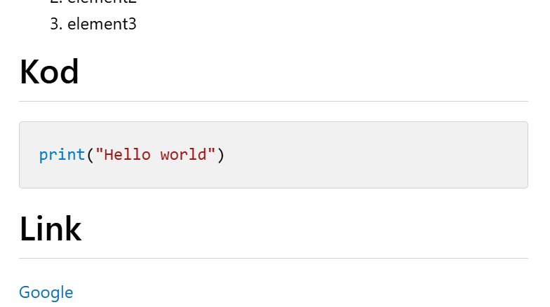

# Nagłówek
## Nagłówek2
### Nagłówek3
#### Nagłówek4

**pogrubiony**

*kursywa*

***pogrubion i kursywa***

# Lista

- element1
- element2
- element3

1. element1
2. element2
3. element3

# Kod
```python
print("Hello world")
```

# Link
[Google](https://github.com/)

# Obrazy



# Cytat
> Jest jak jest

---
 lina pozioma

 # Checkboxy

[x]

[ ]

# Tabela

| Jezyk | Poziom |
|-------|--------|
| Java  | Latwy  |
| Java  | Latwy  |
